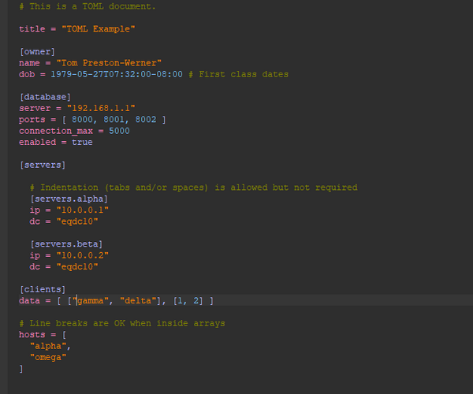

# NPP-TOML-Syntax

[](LICENSE)

This is provides syntax highlighting for [TOML][toml] in Notepad++. This repo strives to always support the latest release, which is as of writing this [TOML v0.5.0][currver].

## Getting started
1. Download ```TOML.xml``` or ```TOML(dark).xml```. You can download the file by either cloning the repository or going  [here][rawTOML] for light or [there][rawTOML(dark)] and press ```CTRL-S``` on the keyboard.
2. Start Notepad++.
3. In the *Language* menu choose *Define your language...*
4. Click *import* and choose ```TOML.xml/TOML(dark).xml```.
5. Restart Notepad++ and it should now detect files with _.toml_ extension automatically.
**NotaBene:** You can save your custom language definition respectively for each xml file. Give a name as you wish for white and dark themes. 



[toml]: https://github.com/toml-lang/toml
[currver]: https://github.com/toml-lang/toml/releases
[rawTOML]: https://raw.githubusercontent.com/Theodor-Lindberg/NPP-TOML-Syntax/master/TOML.xml
[rawTOML(dark)]: 
